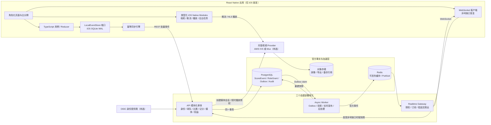

# GameChanger 类产品 MVP

这是一个严格按 GameChanger 独立项目 Notion 02–04 基线搭建的全栈架构仓库。首发范围是：**海外邀请制小范围试点、棒球、React Native iOS 推流端、React Native iOS 观看端、球队指定官方记分员、720p 单机位受控直播、免费权益接口、无真实订阅购买**。

> 当前交付是可运行、可测试的架构骨架，不是可公开发布的成品。默认只运行固定合成数据，不连接任何已有数据库、Redis、对象存储、视频项目或 Apple 账户。

## 1. 当前结果

已完成：

- TypeScript + pnpm Monorepo；共享契约、领域层、应用层和基础设施适配层。
- API 模块化单体、独立 Realtime Gateway、独立 Async Worker 三个部署单元。
- 不可变 `ScoreEvent`、逐场官方序号、确定性重放、纠错事件、终场保护和版本门禁。
- `authority_epoch` 单写者规则、显式交接、旧设备事件隔离和审计/outbox。
- PostgreSQL schema、事务提交适配器、Worker `FOR UPDATE SKIP LOCKED` outbox 消费和投影重建。
- Redis Pub/Sub 实时扇出；断线/丢消息由 canonical sequence 检测并回退 snapshot/events API。
- React Native iOS 官方记分员/获批球迷双角色入口、实时比分牌、离线事件日志抽象、同步引擎、WebSocket 客户端、canonical sequence 缺口恢复协调器、Turbo Native Module 规格。
- OIDC 生产认证接口、开发态合成身份、角色/范围授权、短时播放授权。
- `PilotGrant`/Quota/Offer 边界；`Offer.purchasable=false`，没有 StoreKit 可达路径。
- 19 个自动化测试；包含内存 API → Realtime Gateway → WebSocket 观看端端到端验证。

暂未完成且不能伪装为完成：

- 公司教练尚未签字冻结 OfficialStatSet v1；当前只有 `draft-unapproved` 事件子集。
- iOS 原生 host、SQLite/AVFoundation/AVPlayer/APNs/Keychain 实现要等 Apple 参数确认后在 macOS 生成。
- AWS IVS 与 Mux 尚未选型，因此只有 `VideoProvider` 端口和 Mock Provider。
- 首发国家、政策版本、保留期、删除 SLA、监护同意法律口径尚未冻结。
- 真实临时 PostgreSQL/Redis 集成测试、真机/XCTest/XCUITest、5 倍峰值压测和 PITR 演练尚未执行。
- 球队自助创建、邀请交付、名单管理、同意撤回、内容下架和运营后台只具备领域/表结构边界，尚未形成完整 UI 旅程。

完整缺口见 [MVP_GAP_AUDIT.md](docs/MVP_GAP_AUDIT.md)，Notion 对照见 [NOTION_TRACEABILITY.md](docs/NOTION_TRACEABILITY.md)。

## 2. 总体架构



关键原则：

- PostgreSQL 是唯一服务端事实源；Redis 和 WebSocket 允许短暂丢消息，但不能决定官方比分。
- iPhone SQLite 先提交再更新 React Native UI；网络恢复后按 `client_event_id` 幂等同步。
- 直播与记分独立降级：视频失败不能阻断官方记分，记分离线不能主动终止视频。
- 原始视频帧不跨 JS/Native 边界；媒体、Keychain、APNs 和后台任务保持原生执行。
- 所有 P0 内容默认私密；匿名观看、公开分享、运动员登录和真实购买均关闭。

## 3. 仓库结构

```text
apps/
  api/            API 模块化单体与内存模式纵向切片
  realtime/       WebSocket Gateway；生产 Redis / 本地 HTTP 恢复源
  worker/         PostgreSQL Outbox Worker；本地模式走 API 内部端点
  mobile/         React Native iOS 业务层、同步、实时与 Native 规格
packages/
  contracts/      Zod REST/WebSocket/领域事件契约
  domain/         记分投影、权限、额度和核心类型
  application/    用例、Port、内存适配器、合成固定数据
  infrastructure/ PostgreSQL、Redis、OIDC 生产适配器
database/
  migrations/     仅供明确目标数据库执行的版本化 SQL；本轮未执行
tests/fixtures/   可复现的合成 GoldenGame 草案
infra/            独立名称/端口的 Compose 示例；本轮未启动
docs/             缺口审计与 Notion 追踪矩阵
```

## 4. 安全的本地启动

要求：Node.js 22+、pnpm 11+。默认启动不需要 PostgreSQL、Redis、Docker、Apple 或视频服务账户。

```powershell
pnpm install
pnpm typecheck
pnpm test
pnpm dev:api
```

另开终端启动开发态实时和 Worker：

```powershell
pnpm dev:realtime
pnpm dev:worker
```

健康检查：

```powershell
curl.exe http://127.0.0.1:4100/health
```

期望结果明确显示未连接数据库：

```json
{"status":"ok","mode":"memory","databaseConnected":false,"videoProvider":"mock"}
```

合成身份令牌格式为 `Bearer dev:<account UUID>`。固定账号与用途：

| 角色 | 合成账号 |
|---|---|
| Team Staff | `00000000-0000-4000-8000-000000000001` |
| Official Scorekeeper | `00000000-0000-4000-8000-000000000002` |
| Videographer | `00000000-0000-4000-8000-000000000003` |
| Guardian/Family | `00000000-0000-4000-8000-000000000004` |
| Approved Fan | `00000000-0000-4000-8000-000000000005` |
| 无权限外部账号 | `00000000-0000-4000-8000-000000000006` |

所有名称都是合成数据，不代表真实个人或未成年人。

## 5. 主要 API

| 方法 | 路径 | 用途 |
|---|---|---|
| `GET` | `/health` | 进程健康与实际适配器状态 |
| `GET` | `/v1/bootstrap` | 当前成人账号的试点球队、比赛、权限和策略 |
| `POST` | `/v1/games/:id/score-events:batch` | 带规则/统计版本和 authority epoch 的幂等同步 |
| `GET` | `/v1/games/:id/events` | canonical sequence 增量恢复 |
| `GET` | `/v1/games/:id/snapshot` | 官方事件确定性重放快照 |
| `POST` | `/v1/games/:id/scorer-authority` | Team Staff 显式交接官方记分员 |
| `POST` | `/v1/games/:id/stream-sessions` | 被委派角色创建 720p 视频会话 |
| `POST` | `/v1/games/:id/playback-authorizations` | 角色校验后的短时播放授权 |
| `GET` | `/v1/offers` | 研究 Offer，恒定 `purchasable=false` |
| `GET` | `/v1/me/entitlements` | PilotGrant 与免费分钟状态 |

`/internal/*` 只供 Realtime/Worker 使用，必须携带独立内部令牌，不是公开客户端 API。

## 6. 数据与记分不变量

- `AthleteProfile.login_enabled=false`，不存生日、住址、学校、精确位置、联系方式或儿童凭据。
- 每个 `ScoreEvent` 带 `schemaVersion`、`rulesVersion`、`statSetVersion`、`correlationId`、`authorityEpoch` 和逐场 `sequence`。
- `(game_id, client_event_id)` 与 `(game_id, sequence)` 唯一。
- 相同 `client_event_id` 内容不同时返回 `DUPLICATE_REQUEST`，不接受伪重试。
- Correction 是新事件；原事件、操作者、原因和时间不被改写。
- `GAME_FINALIZED` 后普通事件被拒绝；未来重开必须设计独立高权限审计命令。
- authority 交接递增 epoch；过期设备事件进入 `quarantined_score_events`。
- ScoreEvent、Game revision、AuditLog 与 Outbox 在生产适配器中同一 PostgreSQL 事务提交。
- Worker 从事件重建 GameSnapshot；Redis 只转发已提交的官方事件。

## 7. 环境隔离和生产 Gate

复制 [.env.example](.env.example) 为 `.env` 只会影响当前仓库启动的进程。不要填入其他项目的数据库或 Redis 地址。

生产模式在以下任一条件不成立时拒绝启动：

- `APP_MODE=postgres` 且提供本项目专用 `DATABASE_URL`。
- 提供本项目专用 `REDIS_URL`；Redis 不能代替 PostgreSQL。
- `AUTH_PROVIDER=oidc` 且配置 issuer/audience。
- `VIDEO_PROVIDER` 不能为 mock，且必须注入已评审的 AWS IVS 或 Mux Adapter。
- `POLICY_REGION_CODE` 不能为 `UNSET`，OfficialStatSet 不能是 draft。
- `PUBLIC_SHARING_ENABLED=false`、`ATHLETE_LOGIN_ENABLED=false` 不可覆盖。
- 指定试点 team/game；免费额度和容量阈值由产品/运营确认，不写死在客户端。

仓库内的 [compose.example.yaml](infra/compose.example.yaml) 使用独立项目名、网络、卷和非默认宿主端口 `55432/56379`，但**本轮未启动**。SQL migration 也**从未对任何数据库执行**。

## 8. React Native iOS 边界

React Native 版本按当前官方稳定线配置为 0.87，采用 New Architecture 的类型化 Codegen 规格。依据 [React Native Turbo Native Modules](https://reactnative.dev/docs/turbo-native-modules-introduction)，原生 host 应在 macOS 由 Community CLI 生成，再实现：

- `NativeScoreEventStore`：SQLite 事务、WAL、待同步队列、ack 和迁移。
- `NativeBroadcastSession`：相机/麦克风权限、AVFoundation/供应商 SDK、720p 推流和状态事件。
- Fabric/AVPlayer 播放视图、Keychain、APNs、BackgroundTasks/URLSession。

为什么没有在 Windows 上伪造 Xcode 工程，以及待确认参数，见 [IOS_HOST_PENDING.md](apps/mobile/IOS_HOST_PENDING.md)。

## 9. 验证状态

本轮已实际执行：

- `pnpm typecheck`：通过，包括所有后端包与 React Native TypeScript。
- `pnpm test`：6 个测试文件、19 个测试全部通过。
- 内存 API / Realtime 集成：受权观看端收到 API 接受后的 canonical score event；未授权订阅保留 `ROLE_MISSING`；测试后所有临时回环服务均已关闭。

本轮没有执行：Docker、migration、外部网络服务登录、真实视频推流、iOS 构建、TestFlight、真机、生产数据读写。

## 10. 下一步需用户确认

继续接入环境前，请明确回复：

1. 依赖环境使用本仓库独立 Docker Compose，还是你会提供**GameChanger 专用** PostgreSQL/Redis/对象存储？不要提供其他项目实例。
2. 视频供应商选择 AWS IVS、Mux，还是继续只使用 Mock 做功能开发？
3. iOS Bundle ID、Apple Team ID、最低 iOS 版本，以及用于生成原生 host 的 macOS/Xcode 环境是否已准备？
4. 首发国家/地区、政策负责人、数据保留天数和删除 SLA 是什么？
5. 公司教练何时提供 OfficialStatSet v1、rules version、GoldenGame 与签字人？
6. 免费视频分钟数、试点球队数、同时比赛数、单场峰值观看数是多少？

在这些问题明确前，安全默认值仍是：合成数据、邀请制、未知地区 Fail Closed、无真实购买、无生产视频、无外部数据库连接。

## 11. Notion 基线

- [GameChanger｜独立项目｜开发大纲](https://app.notion.com/p/3c8231db955781e6b269c0f51aa3a371)
- [02｜核心 MVP 与产品边界](https://app.notion.com/p/3c8231db955781af925dda7536430568)
- [03｜系统架构与端到端流程](https://app.notion.com/p/3c9231db9557816491b3e824e41c4a78)
- [04｜数据、权限、合规与测试方案](https://app.notion.com/p/3c9231db9557819da65adbec51c48041)

2026-9-3
已找到并修复 7 个实际问题：
- 停用或删除账号仍能凭开发令牌访问 API。
- 其他球队的授权可能读取当前试点球队信息。
- 已过期、撤销或错误作用域授权被错误纳入 Bootstrap。
- 比赛结束或取消后仍能创建直播。
- 离线事件同步时会被覆盖为当前权限版本，破坏旧事件隔离和审计。
- 实时比分发生序号缺口后，恢复数据但没有重新订阅。
- 畸形 WebSocket 消息可能导致 React Native 应用异常。
- 生产环境可能错误接受示例内部服务令牌。

