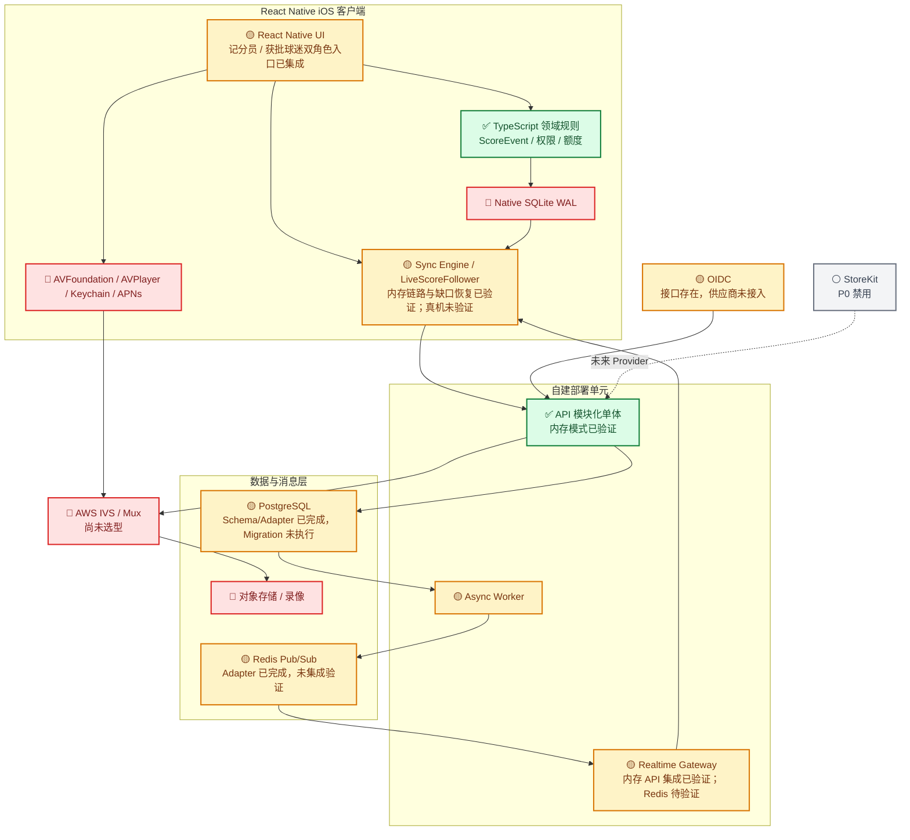

# GameChanger 当前项目架构与实现状态

> 基线日期：2026-09-01。`✅` 表示代码已实现且具备本地验证证据；`🟡` 表示代码骨架存在但未完成真实集成；`🔴` 表示尚未实现；`⚪` 表示 P0 主动关闭。

## 总体架构

## 当前严格结论

- 已完成并验证：领域记分规则、权限/单写者、额度、核心内存 API、共享契约和模块化工程结构。
- 代码存在但未完成生产集成：React Native 记分员/获批球迷双入口、实时比分协调器和 Realtime Gateway 已通过内存端到端验证；Worker、PostgreSQL、Redis、OIDC 仍待专用环境集成。
- 尚未实现：iOS Native SQLite、媒体能力、真实视频、APNs、完整球队/观看/运营旅程及 TestFlight。
- P0 主动关闭：StoreKit 真实购买、公开分享、匿名观看和运动员自助登录。

## 验证证据

- `pnpm typecheck`：2026-09-01 通过。
- `pnpm test`：6 个测试文件、19 个测试全部通过。
- 内存端到端：API 接受官方记分事件后，受权 WebSocket 观看端收到相同 canonical sequence；序号缺口触发客户端回源重放。
- 未执行：数据库 Migration、Redis/PostgreSQL 集成、iOS 真机、真实视频、5 倍容量和 PITR 演练。

详细分层矩阵与进入 Alpha 的顺序见 Notion 子页面“03A｜当前项目架构与实现状态（2026-09-01）”。
